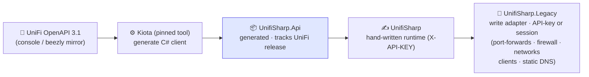

# UnifiSharp

[](https://www.nuget.org/packages/Chrison.UnifiSharp/)
[](https://www.nuget.org/packages/Chrison.UnifiSharp/)
[](https://github.com/Chrison-dev/UnifiSharp/actions/workflows/ci.yml)
[](https://github.com/Fallout-build/Fallout)
[](LICENSE)

A C# client for the **UniFi Network API** — **mostly code-generated** from
Ubiquiti's official OpenAPI spec, with a thin hand-written runtime for auth and
transport. Sibling to [ProxmoxSharp](https://github.com/Chrison-dev/ProxmoxSharp);
built to bring the UniFi-managed network under the homelab's C#-native IaC. See
[ADR-0003](https://github.com/Chrison-Homelab/Homelab/blob/main/docs/adr/ADR-0003-unifisharp.md).

```sh
dotnet add package Chrison.UnifiSharp
```

## Approach



The UniFi spec is already OpenAPI 3.1, so — unlike ProxmoxSharp — there's **no
converter**; Kiota consumes it directly. The generated client is **regenerated
on build** (only when the spec changes) and **not committed**.

> **Write coverage caveat (per ADR-0003):** the official API is read-mostly today
> (firewall rules / port profiles not yet exposed; full write rolling out through
> 2026). Those will be filled by a thin, deletable **legacy adapter** later. This
> repo starts **read-only**.

## Projects & versioning

| Project | What | Version |
| --- | --- | --- |
| `src/UnifiSharp.Api/` | Kiota-generated client. `Generated/` produced on build (gitignored). | **Tracks the UniFi Network API release** (e.g. `10.4.57`). |
| `src/UnifiSharp/` | Hand-written runtime (`UnifiApi`, X-API-KEY auth, options) over `.Api`. | **Independent SemVer** (`0.1.0`). |
| `tests/UnifiSharp.Tests/` | Unit tests. | — |

## Build

Built with [Fallout](https://github.com/Fallout-build/Fallout) (Chris's C#/.NET
build system, a NUKE successor). Targets: `Compile` → `Test` → `Pack` → `Publish`.

```bash
./build.sh              # default: Test (Compile regenerates UnifiSharp.Api from the spec, then compiles)
./build.sh Pack         # produce the Chrison.* nupkgs into artifacts/
```

Requires the .NET 10 SDK (see `global.json`); everything, including `Fallout.*`,
restores from nuget.org with no credentials. CI runs `./build.sh Test` on push/PR.

## Use it

```csharp
var client = UnifiApi.Create(new UnifiClientOptions
{
    // NOTE: no /v1 — the generated client appends the version segment itself.
    // UniFi OS (Cloud Gateway/UDM/UniFi OS Server):  https://<host>/proxy/network/integration
    // Standalone Network Application:                 https://<host>:8443/integration
    BaseUrl = new Uri("https://192.168.1.1/proxy/network/integration"),
    ApiKey  = "<local API key — Settings → Integrations>",
    VerifyTls = false,   // self-signed LAN cert
});
// read endpoints: sites, networks, WLANs, firewall zones, devices, clients …
```

> **Base-URL note (verified 2026-05-31 against the `.containers/unifi` UniFi OS
> Server container):** set `BaseUrl` to the integration root **without** `/v1` —
> the client adds `/v1/…`. UniFi OS exposes it under `/proxy/network/integration`;
> a standalone Network Application omits that prefix (`/integration`).

## Packages

Published to **nuget.org** (public) under the `Chrison.*` prefix, via **Trusted
Publishing** (OIDC — no stored API key): `Chrison.UnifiSharp`, `Chrison.UnifiSharp.Api`,
`Chrison.UnifiSharp.Cli`. Prerelease on push to `main` (`…-preview.N`), stable on a
`v*` tag. `.Api` tracks the UniFi API release; the library its own SemVer. IDs use the
`Chrison.*` prefix because the bare `UnifiSharp` ID is taken on nuget.org by an unrelated
project; assembly names and namespaces stay `UnifiSharp`, so `using UnifiSharp;` is unchanged.

## Refresh the spec (new UniFi release)

Pull the OpenAPI for the controller's version from the console (Settings →
Integrations) or the [`beezly/unifi-apis`](https://github.com/beezly/unifi-apis)
mirror into `src/UnifiSharp.Api/schema/`, update the filename + `VersionPrefix`,
rebuild.

## CLI (`unifisharp`)

A `dotnet` global tool over the library:

```bash
export UNIFI_BASE_URL="https://localhost:8443/proxy/network/integration/v1"
export UNIFI_API_KEY="…"  UNIFI_VERIFY_TLS=false
unifisharp sites       # list sites
unifisharp discover    # JSON snapshot: sites + networks/WLANs/firewall/devices/clients
unifisharp networks    # networks/VLANs per site (name, vlan id, purpose, enabled)
unifisharp wlans       # WLANs/SSIDs per site (ssid, enabled, security)
unifisharp firewall    # firewall zones, policies, and ACL rules per site
unifisharp devices     # adopted devices per site (name, model, ip, mac, firmware, state)
unifisharp clients     # connected clients per site (name, type, ip, connectedAt)
```

## Legacy adapter auth

`UnifiLegacyOptions` takes either credential, and `TryFromEnvironment()` prefers the key:

| Mode | Set | Notes |
|---|---|---|
| **API key** | `UNIFI_API_KEY` + (`UNIFI_LEGACY_BASE_URL` or `UNIFI_LOCAL_HOST`) | `X-API-KEY` on every request — no login, cookie or CSRF token. Preferred against a real gateway; the same key the integration API uses. |
| **Session** | `UNIFI_USERNAME` + `UNIFI_PASSWORD` + base URL | `POST /api/auth/login`. The only mode the `.containers/unifi` test container supports, since it can't mint API keys. |

With `UNIFI_LOCAL_HOST` alone the site URL is derived as
`https://<host>/proxy/network/api/s/default`.

> The **destructive** live tests (`UnifiLegacyLiveTests` — they create and delete a
> port-forward, a firewall group and a VLAN) are gated on *session* auth on purpose,
> so a shell holding only an API key can never point them at a production gateway.
> Read-only live checks (`UnifiLegacyReadOnlyLiveTests`) run in either mode.

### Two surfaces, two sets of rules

The adapter spans the legacy site API **and** the v2 site API, and they do not behave
alike. Assuming otherwise fails only at runtime, against a real controller:

| | legacy `…/api/s/<site>` | v2 `…/v2/api/site/<site>` |
|---|---|---|
| response | `{ "meta": {...}, "data": [...] }` | bare JSON array / object |
| update | **partial** — send only changed fields | **full replacement** — a partial PUT is `400 Validation failed` |
| covers | port-forwards, firewall groups, networks, clients | static DNS |

That is why `UnifiStaticDnsRecord` is non-nullable throughout while the legacy DTOs are
nullable: on v2 a partial is not something you can send, so the type should not suggest it.
Static-DNS **wildcards are supported** and match arbitrary labels
(`*.lab.example.com` answers `anything.lab.example.com`).

## Status

Read client + `discover` + `unifisharp` CLI building from the 10.4.57 spec.
Live read tests skip without `UNIFI_*` — run them against the
[`.containers/unifi`](https://github.com/Chrison-dev/Homelab/tree/main/.containers/unifi)
test controller (never the live network). **Next:** the legacy write adapter
(firewall rules / port profiles) once verified against the container.
